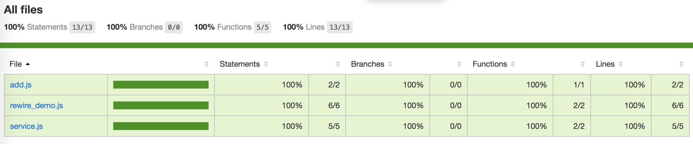

# Javascript单元测试介绍

## 目录

* mocha介绍
* chai介绍
* 准备工作
* 使用
* mocha参数说明
* rewire介绍
* sinon介绍
* nyc介绍

### mocha介绍

Mocha is a feature-rich JavaScript test framework running on Node.js and in the browser, making asynchronous testing simple and fun.

官网地址 https://mochajs.org/

mocha是一个JavaScript测试框架，在浏览器和Node环境都可以使用。

类似的测试框架还有Jasmine、Karma、Tape等

### chai介绍

Chai is a BDD / TDD assertion library for node and the browser that can be delightfully paired with any javascript testing framework.

官网地址 http://chaijs.com/

Mocha本身不带断言库，所以必须先引入断言库，而chai就是一个断言库，类似的库有should。我们这里使用它的expect断言风格。

```js
// 相等或不相等
expect(4 + 5).to.be.equal(9);
expect(4 + 5).to.be.not.equal(10);
expect(foo).to.be.deep.equal({ bar: 'baz' });

// 布尔值为true
expect('everthing').to.be.ok;
expect(false).to.not.be.ok;

// typeof
expect('test').to.be.a('string');
expect({ foo: 'bar' }).to.be.an('object');
expect(foo).to.be.an.instanceof(Foo);

// include
expect([1,2,3]).to.include(2);
expect('foobar').to.contain('foo');
expect({ foo: 'bar', hello: 'universe' }).to.include.keys('foo');

// empty
expect([]).to.be.empty;
expect('').to.be.empty;
expect({}).to.be.empty;

// match
expect('foobar').to.match(/^foo/);
```


### 准备工作
```
npm init -y
npm install mocha --save-dev
npm install chai --save-dev
npm install nyc --save-dev
npm install rewire --save-dev
npm install sion --save-dev
```
package.json创建两个npm脚本

```
"scripts": {
    "test": "mocha",
    "test-cov": "nyc --reporter=html mocha"
  }
```  	

### 使用

新建一个add.js

```js
function add(x, y) {
  return x + y;
}
module.exports = add;
```

通常，测试脚本与所要测试的源码脚本同名，但是后缀名为.test.js（表示测试）或者.spec.js（表示规格）。比如，add.js的测试脚本名字就是add.test.js。

新建add.test.js

```js
'use strict';
const add = require('./add.js');
const expect = require('chai').expect;

describe('加法函数的测试', function() {
  it('1 加 1 应该等于 2', function() {
    expect(add(1, 1)).to.be.equal(2);
  });
});
```
执行

	npm run test
	
输出

```
加法函数的测试

  ✓ 1 加 1 应该等于 2

  1 passing (16ms)	
```  


上面这段代码，就是测试脚本。测试脚本里面应该包括一个或多个describe块，每个describe块应该包括一个或多个it块。

describe块称为"测试套件"（test suite），表示一组相关的测试。它是一个函数，第一个参数是测试套件的名称（"加法函数的测试"），第二个参数是一个实际执行的函数。

it块称为"测试用例"（test case），表示一个单独的测试，是测试的最小单位。它也是一个函数，第一个参数是测试用例的名称（"1 加 1 应该等于 2"），第二个参数是一个实际执行的函数。

Mocha默认运行test子目录里面的测试脚本。所以，一般都会把测试脚本放在test目录里面，然后执行mocha就不需要参数了

### mocha部分参数说明

* --help或-h参数，用来查看Mocha的所有命令行参数

* --recursive参数，这时test子目录下面所有的测试用例，不管在哪一层都会执行

* --reporter参数用来指定测试报告的格式，默认是spec格式

可以使用 `mocha --reporters` 来查看所有内置的报告格式

这是内置的报告格式

```js
	dot - dot matrix
    doc - html documentation
    spec - hierarchical spec list
    json - single json object
    progress - progress bar
    list - spec-style listing
    tap - test-anything-protocol
    landing - unicode landing strip
    xunit - xunit reporter
    min - minimal reporter (great with --watch)
    json-stream - newline delimited json events
    markdown - markdown documentation (github flavour)
    nyan - nyan cat!
```

* --watch参数用来监视指定的测试脚本。只要测试脚本有变化，就会自动运行Mocha

* --timeout 测试用例的超时时间，毫秒为单位，默认是2000ms

也可以通过把这些参数写在配置文件里面，在test目录下面，放置配置文件mocha.opts

例如

```js
--reporter tap
--recursive
```
执行 `mocha` 和 直接执行 `mocha --reporter tap  --recursive` 一致的

### mocha测试用例钩子

Mocha在describe块之中，提供测试用例的四个钩子：before()、after()、beforeEach()和afterEach()。它们会在指定时间执行

```js
describe('hooks', function() {

  before(function() {
    // 在本区块的所有测试用例之前执行
  });

  after(function() {
    // 在本区块的所有测试用例之后执行
  });

  beforeEach(function() {
    // 在本区块的每个测试用例之前执行
  });

  afterEach(function() {
    // 在本区块的每个测试用例之后执行
  });

  // test cases
});
```


### rewire介绍

rewire adds a special setter and getter to modules so you can modify their behaviour for better unit testing. You may

inject mocks for other modules or globals like process
inspect private variables
override variables within the module.

[https://github.com/jhnns/rewire]()

它的基本功能与require相同，都是用于导入模块，只是，它会为导入的模块添加两个特殊的函数：__get__与__set__。顾名思义，这两个函数可以分别用于获取和修改模块中的变量/函数。测试的时候，当我们需要获取或者重写私有变量/函数，rewire非常有用。

 `__get__`: 获取私有变量/函数
 
 `__set__`: 重写私有变量/函数

例如：

```js

'use strict';

function add(a, b){
    let result = a + b;
    sub(a, b);
    return result;
}

// 私有函数sub
function sub(a, b) {
    return a - b;
}

exports.add = add;

```

按照上面的测试方法，sub方法是没有办法测试到的，这时使用rewire就可以解决这个问题了

```js
'use strict';
const rewire = require("rewire");
const myModule = rewire("../rewire_demo.js");

myModule.__set__("sub", function(a, b) {
  return a * b;
});
const sub = myModule.__get__("sub");
const add = require('../rewire_demo.js').add;
const expect = require('chai').expect;


describe('函数的测试', function() {
  it("1加1等于2", function(){
    expect(add(1, 1)).to.be.equal(2);
  });
  it('2 减 2 应该等于 4', function() {
    expect(sub(2, 2)).to.be.equal(4);
  });
});
```

输出

```js
函数的测试
    ✓ 1加1等于2
    ✓ 2 减 2 应该等于 4


  2 passing (27ms)
```

### sinon介绍

官网地址 [http://sinonjs.org/]()

当在进行单元测试的时候，你可能不希望将其依赖于其他的类库，这种依赖性很可能会使你写的函数产生一定的副作用，而sinon可以极大的减少这种副作用.

Sinon提供了3种类型：

* Spies，提供了函数调用的信息，但不会改变其行为

* Mocks，通过组合spies和stubs，使替换一个完整对象更容易

* Stubs，类似Spies，但是是完全替换目标函数。这可以让你随心所欲的控制函数–抛异常，返回指定结果等

例如

```js
'use strict';
const request = require('request');

module.exports = function (url, callback) {
  request.get(url, function(err,response, body){
     callback(null, body);
  });
}

```


```js
'use strict';

const sinon = require('sinon');
const getUrlContent = require('../service');
const request = require('request');
const expect = require('chai').expect;
describe('getUrlContent(url, callback)', function() {
  const url = 'http://example.com';
  const body = 'source code';
  beforeEach(function() {
    sinon.stub(request, 'get').withArgs(url).yields(null, null, body);
  });

  it('should return the source code', function(done) {
    getUrlContent(url, function(err, result) {
      expect(result).to.be.equal(body);
      done();
    });
  });

  afterEach(function() {
    request.get.restore();
  });
});
```


既然是给功能代码写单元测试，那就应该有个指标去衡量单元测试覆盖了哪些功能代码，这就是接下来要介绍的测试覆盖率

### nyc介绍

[https://istanbul.js.org/]()

nyc是一个测试代码覆盖率的库，使用很简单

`npm install nyc --save-dev`

运行

`npm run test-cov`


会在项目目录下生成coverage文件夹，打开它下面的index.html文件




Thank you

